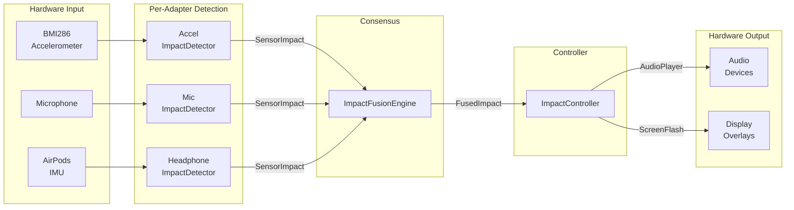
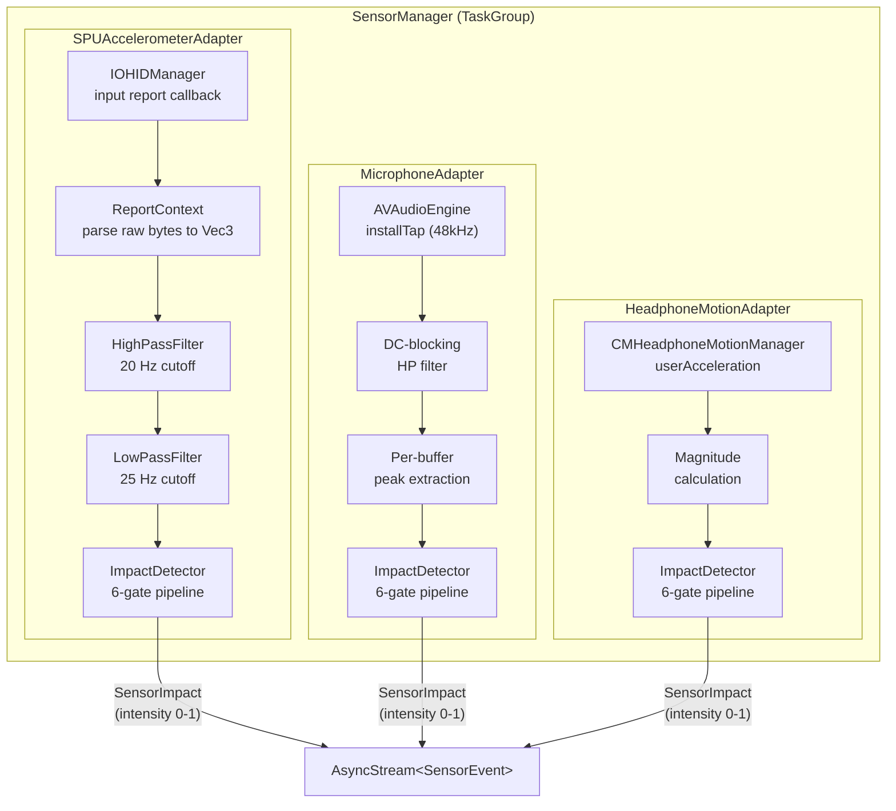
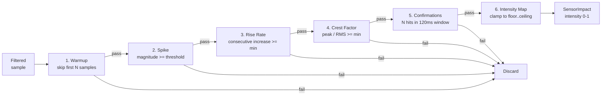
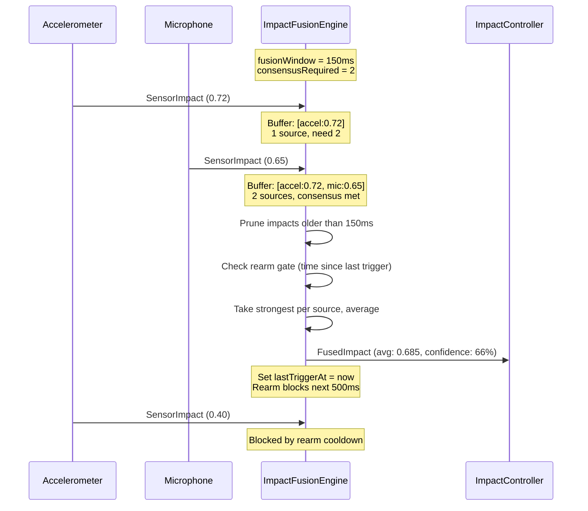
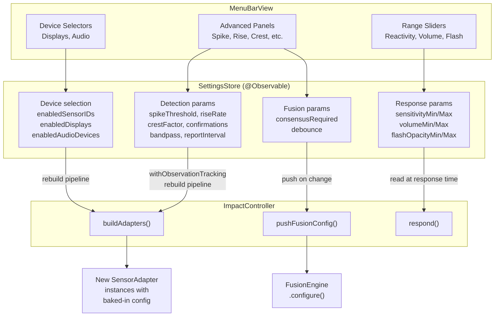
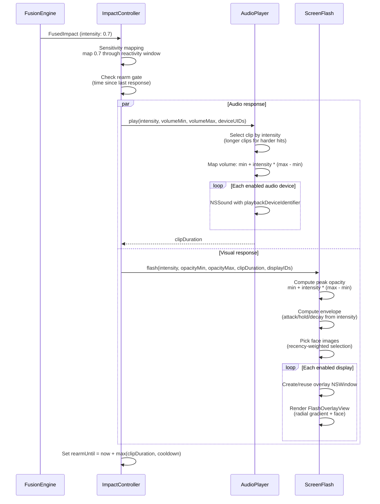
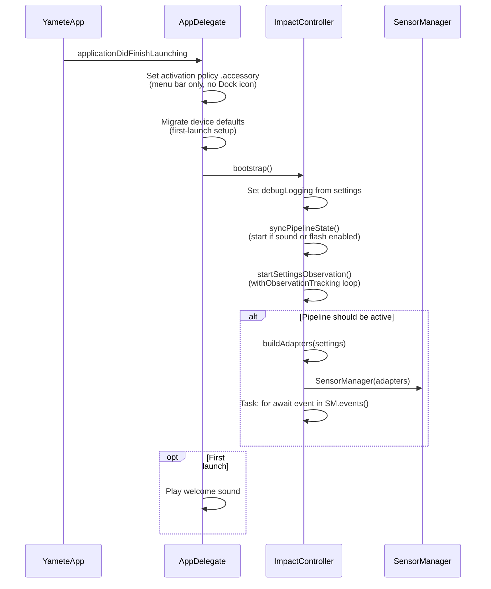
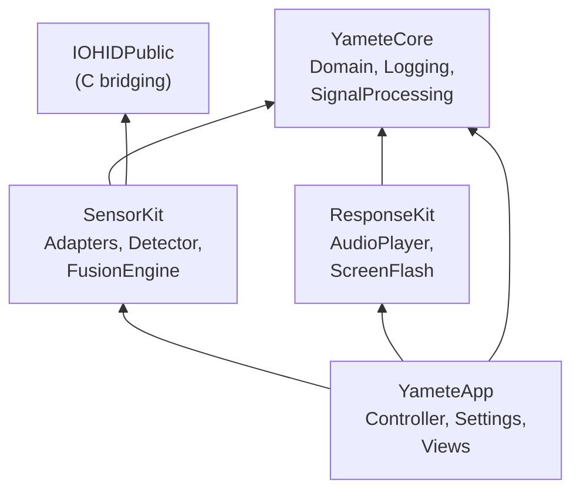

# Architecture

Yamete is a macOS menu bar app that detects physical impacts on Apple Silicon MacBooks and responds with audio and visual feedback. Four SPM modules with a unidirectional dependency graph:

```
YameteCore  <──  SensorKit
                     │
YameteCore  <──  ResponseKit
                     │
YameteApp  ──>  SensorKit, ResponseKit, YameteCore
```

## Module responsibilities

| Module | Role | Key types |
|--------|------|-----------|
| **YameteCore** | Shared types, logging, signal processing | `Vec3`, `ImpactTier`, `SensorID`, `HighPassFilter`, `LowPassFilter`, `RingBuffer` |
| **SensorKit** | Sensor adapters, per-adapter detection, multi-sensor fusion | `SensorAdapter`, `SensorManager`, `ImpactDetector`, `ImpactFusionEngine` |
| **ResponseKit** | Audio playback, screen flash, device enumeration | `AudioPlayer`, `ScreenFlash`, `AudioDeviceManager` |
| **YameteApp** | App shell: controller, settings, UI | `ImpactController`, `SettingsStore`, `MenuBarView` |

## End-to-end data flow

The pipeline has three phases: **fan-out** (parallel sensor detection), **fan-in** (consensus fusion), and **fan-out** (parallel hardware response).



## Phase 1: Sensor fan-out

Each sensor adapter conforms to the `SensorAdapter` protocol and runs its own independent detection pipeline. Adapters are instantiated by `ImpactController.buildAdapters()` using current settings, then run concurrently inside `SensorManager` via a `TaskGroup`.



### ImpactDetector gate pipeline

Every adapter feeds samples through the same `ImpactDetector` instance. All six gates must pass for a sample to produce a `SensorImpact`:



Background RMS is tracked with a slow exponential moving average (alpha = 0.02) so the crest factor gate adapts to ambient noise floor changes.

## Phase 2: Consensus fan-in

`ImpactFusionEngine` collects `SensorImpact` events from all active adapters and applies consensus + rearm gating before producing a `FusedImpact`.



### FusedImpact fields

| Field | Description |
|-------|-------------|
| `timestamp` | Time of fusion decision |
| `avgIntensity` | Average of strongest impact per participating source |
| `confidence` | Fraction of active sources that participated |
| `sources` | Set of SensorIDs that contributed |

## Phase 3: Configuration

`SettingsStore` persists all user preferences to `UserDefaults` with clamped ranges. `ImpactController` uses `withObservationTracking` to react to any setting change and rebuild the pipeline.



Settings that require a pipeline rebuild (bandpass frequencies, report interval, enabled sensors) trigger `stopPipeline()` + `startPipeline()`. Response parameters (volume, opacity, reactivity) are read at response time and take effect immediately.

## Phase 4: Response fan-out

When `ImpactController` receives a `FusedImpact`, it maps intensity through the user's reactivity window, then dispatches to audio and screen flash in parallel.



### Audio clip selection

`AudioPlayer` preloads all audio files from the bundle `sounds/` directory, sorted by duration (shortest first). Impact intensity selects a clip from the sorted list — lighter impacts play shorter clips, harder impacts play longer clips. A history of size 2 prevents immediate repeats.

### Screen flash rendering

`ScreenFlash` creates a borderless, transparent `NSWindow` overlay per monitor. The overlay renders a SwiftUI `FlashOverlayView` with:
- Radial gradient background (warm tones fading to transparent)
- Centered face image selected with recency-weighted scoring to avoid repetition
- Animated envelope: ease-in fade up, hold, ease-out fade down
- Duration gated to the audio clip length

## Bootstrap sequence



## Module dependency graph



## Concurrency model

All stateful components are `@MainActor`-confined: `ImpactController`, `SensorManager`, `AudioPlayer`, `ScreenFlash`, `SettingsStore`. Sensor adapters run their I/O on background threads/queues but deliver `SensorImpact` events through `AsyncThrowingStream` continuations that are consumed on the main actor via `SensorManager.events()`.

| Pattern | Where | Purpose |
|---------|-------|---------|
| `AsyncThrowingStream` | Each `SensorAdapter.impacts()` | Stream per-adapter impact events |
| `AsyncStream` | `SensorManager.events()` | Unified event stream from all adapters |
| `TaskGroup` | Inside `SensorManager.events()` | Run adapters concurrently |
| `withObservationTracking` | `ImpactController` | React to settings changes |
| `@MainActor` | Controller, Manager, Responders | Thread confinement for shared state |
| `HIDRunLoopThread` | `AccelerometerReader` | Dedicated thread for IOKit callbacks |
| `OperationQueue` | `HeadphoneMotionAdapter` | CoreMotion delivery queue |
