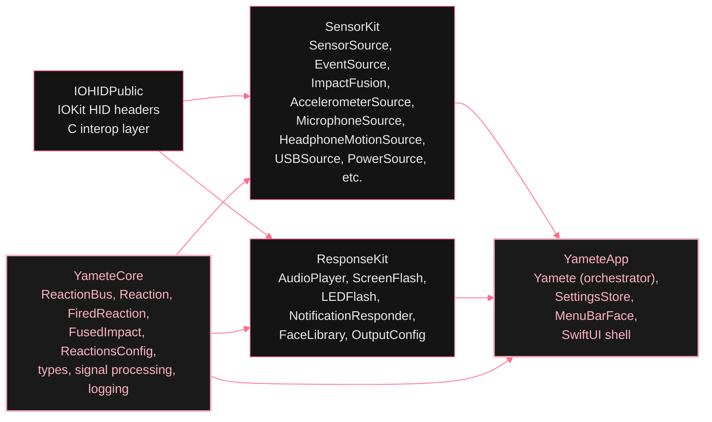
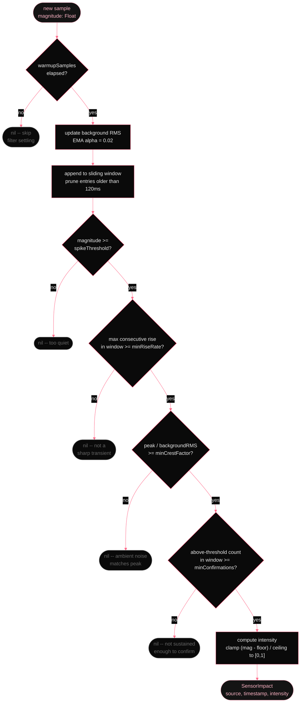
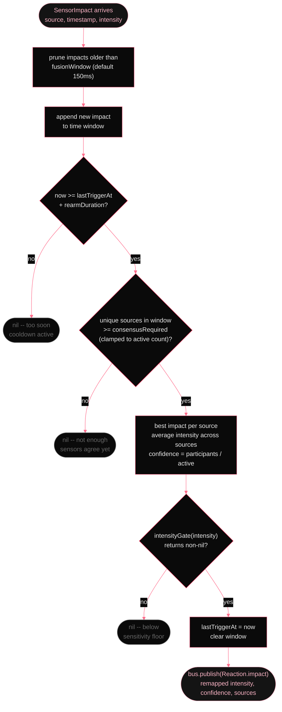
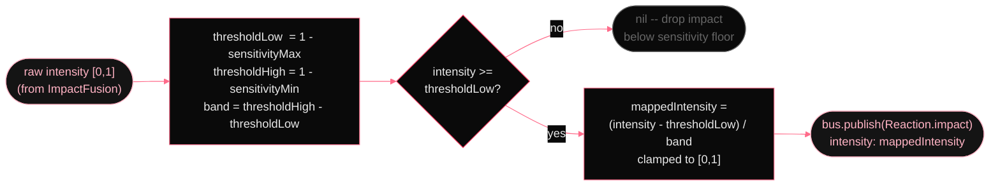
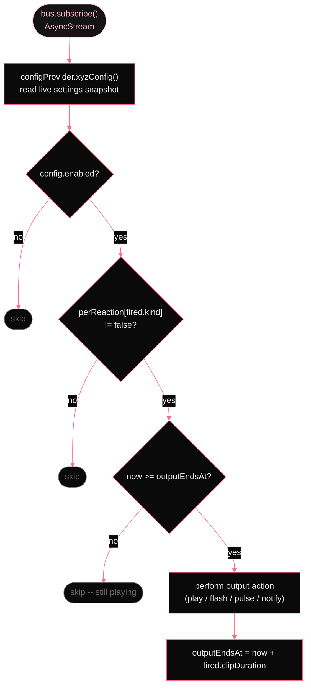

*How Yamete actually does what it does. For people who would rather read a diagram than trust a privacy policy.*

      
Yamete is more engineered than the concept deserves. Two categories of event source. Three parallel impact sensors fused for consensus (accelerometer, microphone, AirPods motion), and eleven discrete state-transition sources watching USB, power, audio peripherals, Bluetooth, Thunderbolt, display hotplug, sleep/wake, lid angle, gyroscope spikes, ambient-light step changes, and thermal pressure transitions. Plus three input-activity sources (keyboard, mouse, trackpad). All of them publish onto a central `ReactionBus`. Independent output consumers (sound, screen flash, LED flash, notifications, keyboard backlight, display tint, haptics, volume spike) subscribe to the bus and react to whatever event types their per-output toggle matrix allows. All of it Swift 6 strict concurrency, all of it offline, all of it firing in under 50 ms from impact to sound.

      
What follows is the real code path, annotated for a technical audience. The diagrams are generated from the actual class and method structure, not a marketing approximation of it.

      
        
## Module graph *(four SPM targets, one direction)*
        
The codebase is split into four Swift Package Manager targets with a strictly unidirectional dependency graph. `YameteApp` sees everything. `IOHIDPublic` sees nothing.

        
          SPM dependency graph
          

        

        
- `IOHIDPublic` -- C header shim exposing private IOKit HID types Apple does not publish. Read-only; never changes.

          - `YameteCore` -- shared types, the reaction bus, signal processing, and logging. No sensor knowledge, no UI. Imported by everything.

          - `SensorKit` -- the entire sensor abstraction: impact sensors (accelerometer, microphone, AirPods motion), infrastructure event sources (USB, power, Bluetooth, audio peripherals, Thunderbolt, display hotplug, sleep/wake), ImpactFusion engine, and ImpactDetector per-sensor gate chain.

          - `ResponseKit` -- audio playback, screen overlay, LED flash, notification dispatch, face image cache. Knows about reactions and intensity; knows nothing about where they came from.

          - `YameteApp` -- the orchestrator. Owns the bus, wires sources and outputs, manages lifecycle. Also the SwiftUI menu bar shell.

      

      
        
## Full signal pipeline *(sensor or event to output)*
        
Two categories of source publish onto the `ReactionBus`. Impact sources run three parallel sensor streams through `ImpactFusion`, which applies consensus and rearm gating before publishing `Reaction.impact`. Infrastructure event sources (USB, power, Bluetooth, etc.) publish discrete `Reaction` cases directly. The bus runs a pre-fan-out enricher that resolves audio clip URL, clip duration, and face indices exactly once per reaction. Four independent outputs each subscribe to the bus via `bus.subscribe()`, receiving an `AsyncStream<FiredReaction>`, and pattern-match the reaction kinds their per-output toggle matrix enables.

        
          End-to-end signal flow

```mermaid
%%{init: {
  "theme": "base",
  "themeVariables": {
    "primaryColor": "#141414",
    "primaryTextColor": "#e8e8e8",
    "primaryBorderColor": "#ff6b8a",
    "lineColor": "#ff6b8a",
    "secondaryColor": "#141414",
    "tertiaryColor": "#0a0a0a",
    "edgeLabelBackground": "#0a0a0a",
    "clusterBkg": "#1a1a1a",
    "clusterBorder": "#ff6b8a",
    "titleColor": "#ffb3c4",
    "nodeTextColor": "#e8e8e8",
    "fontFamily": "SF Mono, ui-monospace, Menlo, monospace"
  }
}}%%
flowchart TD
  subgraph IMPACT["IMPACT SENSORS  (SensorSource, parallel AsyncThrowingStream)"]
    direction LR
    ACC["AccelerometerSource
BMI286 via IOKit HID
bandpass 20-25 Hz
ImpactDetector (6 gates)"]:::sensor
    MIC["MicrophoneSource
AVAudioEngine tap
DC-block filter
ImpactDetector (6 gates)"]:::sensor
    HP["HeadphoneMotionSource
CMHeadphoneMotionManager
userAcceleration magnitude
ImpactDetector (6 gates)"]:::sensor
  end

  subgraph EVENTS["INFRASTRUCTURE & STATE SOURCES  (EventSource, each publishes directly to bus)"]
    direction LR
    USB["USBSource"]:::evtsrc
    PWR["PowerSource"]:::evtsrc
    AUD["AudioPeripheralSource"]:::evtsrc
    BT["BluetoothSource"]:::evtsrc
    TB["ThunderboltSource"]:::evtsrc
    DSP["DisplayHotplugSource"]:::evtsrc
    SW["SleepWakeSource"]:::evtsrc
    GYR["GyroscopeSource
SPU HID usage 9
GyroDetector (6 gates)"]:::evtsrc
    LID["LidAngleSource
SPU HID usage 8
state machine + slam gate"]:::evtsrc
    ALS["AmbientLightSource
SPU HID usage 7
step detector + cover gate"]:::evtsrc
    THR["ThermalSource
NSProcessInfo state-change KVO
cold-start suppressed"]:::evtsrc
    KBD["KeyboardActivitySource"]:::evtsrc
    MSE["MouseActivitySource"]:::evtsrc
    TPD["TrackpadActivitySource"]:::evtsrc
  end

  FUSION["ImpactFusion
fan-in task group
consensus + rearm gate
sensitivity remapping
→ Reaction.impact"]:::fusion

  BUS["ReactionBus (actor)
pre-fan-out enricher:
resolve audio clip URL + duration
FaceLibrary.selectIndices(count:)
stamp publishedAt
→ FiredReaction"]:::bus

  subgraph OUTPUTS["OUTPUTS  (each independently subscribes, pattern-matches ReactionKind)"]
    direction LR
    AP["AudioPlayer
plays pre-selected clip
on enabled Core Audio devices"]:::resp
    SF["ScreenFlash
borderless NSWindow overlays
per-screen face + radial gradient"]:::resp
    LED["LEDFlash
Caps Lock LED PWM
keyboard brightness spring oscillation"]:::resp
    NR["NotificationResponder
UNUserNotificationCenter
tier-phrase, 40 locales"]:::resp
  end

  MBF["MenuBarFace
subscribes to bus
impact-only face swap
NSStatusItem icon"]:::menubar

  ACC -->|"SensorImpact"| FUSION
  MIC -->|"SensorImpact"| FUSION
  HP  -->|"SensorImpact"| FUSION

  FUSION -->|"Reaction.impact"| BUS
  USB -->|"Reaction.usb*"| BUS
  PWR -->|"Reaction.ac*"| BUS
  AUD -->|"Reaction.audioPeripheral*"| BUS
  BT  -->|"Reaction.bluetooth*"| BUS
  TB  -->|"Reaction.thunderbolt*"| BUS
  DSP -->|"Reaction.displayConfigured"| BUS
  SW  -->|"Reaction.willSleep / .didWake"| BUS

  BUS -->|"AsyncStream<FiredReaction>"| AP
  BUS -->|"AsyncStream<FiredReaction>"| SF
  BUS -->|"AsyncStream<FiredReaction>"| LED
  BUS -->|"AsyncStream<FiredReaction>"| NR
  BUS -->|"AsyncStream<FiredReaction>"| MBF

  classDef sensor fill:#141414,stroke:#ff6b8a,color:#e8e8e8
  classDef evtsrc fill:#141414,stroke:#ff6b8a,color:#e8e8e8
  classDef fusion fill:#1a1a1a,stroke:#ffb3c4,color:#ffb3c4,stroke-width:2px
  classDef bus fill:#1a1a1a,stroke:#ffb3c4,color:#ffb3c4,stroke-width:2px
  classDef resp fill:#141414,stroke:#ff6b8a,color:#e8e8e8
  classDef menubar fill:#141414,stroke:#ff6b8a,color:#e8e8e8
```
          

        

        
The bus enricher runs once per reaction before fan-out. All subscribers receive a `FiredReaction` with identical, pre-resolved values: the same `soundURL`, the same `clipDuration`, the same `faceIndices` array, and the same `publishedAt` timestamp. No output re-selects a clip or picks a face — they just consume what the enricher resolved.

      

      
        
## Per-sensor detection gates *(ImpactDetector, all six)*
        
Every impact sensor runs an `ImpactDetector` independently. Each sample passes through six gates in order. All six must pass to produce an intensity value. Any gate failure returns nil for that sample — no event emitted, no noise downstream.

        
          ImpactDetector.process() -- per-sample gate chain
          

        

        
The combination of these gates is what makes Yamete usable at a desk. Typing produces magnitude but no sharp rise. Footsteps produce a rise but the crest factor is too low (ambient RMS is already elevated). A real smack produces all six: a clean spike, a fast transient, a high crest, and multiple samples above threshold in the window.

        
| Gate | What it rejects | Accel default | Mic default | Headphone default |
|---|---|---|---|---|
| warmupSamples | Filter transients on startup (IIR settling) | 50 samples | 50 samples | 50 samples |
| spikeThreshold | Ambient vibration, background noise | 0.020 g | 0.020 PCM | 0.10 g |
| minRiseRate | Slow drifts, HVAC, sustained rumble | 0.010 | 0.010 | 0.05 |
| minCrestFactor | Noisy rooms, street noise (peak/RMS too low) | 1.5 | 1.5 | 1.5 |
| minConfirmations | One-sample spikes, electrical interference | 3 samples | 2 samples | 2 samples |
| intensity mapping | (output stage) maps passing magnitude to 0-1 | 0.002-0.060 g | 0.005-0.300 | 0.05-2.0 g |

      

      
        
## Fusion engine *(ImpactFusion, consensus + rearm)*
        
Individual sensor impacts feed into `ImpactFusion`, which enforces two additional constraints before publishing a `Reaction.impact` onto the bus: consensus (enough sensors must agree within a time window) and rearm (minimum gap between consecutive responses). Before publishing, the sensitivity gate — an `intensityGate` closure set by the orchestrator — maps raw fused intensity through the user's sensitivity band and drops impacts that fall below the floor.

        
          ImpactFusion.ingest() -- one call per SensorImpact
          

        

        
The default `consensusRequired = 1` means any single sensor can trigger a response. Set it to 2 and both the accelerometer and microphone have to agree within 150 ms before anything fires — eliminates most false positives at the cost of some missed detections on very clean impacts. The engine clamps `consensusRequired` to the active source count at runtime, so "require 2" against a single connected sensor still emits.

        
| Parameter | Default | Effect |
|---|---|---|
| fusionWindow | 150 ms | Time window within which multiple sensors must all fire to count as consensus |
| consensusRequired | 1 | Minimum distinct sensor sources in window before firing (clamped to active count) |
| rearmDuration | user debounce | Minimum gap between consecutive fused impacts; set from SettingsStore.debounce |

      

      
        
## Sensitivity gate *(FusedImpact.applySensitivity, pre-publish)*
        
After fusion but before publishing to the bus, intensity passes through one more mapping. The user's sensitivity sliders define a window over the [0,1] intensity range. The gate rejects impacts below the lower edge and linearly rescales survivors to fill [0,1]. This is implemented as an `intensityGate` closure on `ImpactFusion`, set by `Yamete` during init. Infrastructure event sources bypass this gate entirely — they carry synthesized intensities from `ReactionsConfig.eventIntensity`.

        
          Sensitivity window mapping (FusedImpact.applySensitivity)
          

        
      

      
        
## Bus enricher *(pre-fan-out, runs once per reaction)*
        
Before any subscriber receives a reaction, `ReactionBus` runs a registered enricher closure exactly once. The enricher resolves all per-reaction metadata so that every subscriber operates on identical, pre-computed values. The bus stamps `publishedAt` at the moment `publish(_:)` is called — before enrichment begins — so the timestamp is stable regardless of enrichment latency. If enrichment takes longer than 500 ms, the bus publishes a minimal fallback `FiredReaction`.

        
The enricher, registered by `Yamete.startOutputs()`, does three things:

        
- Calls `AudioPlayer.peekSound(intensity:reaction:)` to dedup-filter and intensity-select an audio clip URL and duration. For non-impact reactions, `peekSound` returns nil and the bus falls back to `ReactionsConfig.eventResponseDuration`.

          - Calls `FaceLibrary.shared.selectIndices(count:)` with the current connected screen count to pick one face index per display, scored for recency dedup.

          - Returns a `FiredReaction` carrying the resolved `soundURL`, `clipDuration`, `faceIndices`, and `publishedAt`.

      

      
        
## Response dispatch *(four independent bus subscribers)*
        
Each output independently subscribes to the bus via `bus.subscribe()`, which returns a fresh `AsyncStream<FiredReaction>`. The consumer loop reads a live config snapshot on every reaction and gates by: the output's master enable, the per-output per-reaction toggle matrix, and an internal playback-ends-at guard that prevents overlapping responses.

        
          Output consumer loop (same structure for all four outputs)
          

        

        
| Output | Config type | Action | Notes |
|---|---|---|---|
| AudioPlayer | AudioOutputConfig | Plays the pre-selected fired.soundURL on each enabled Core Audio device. Volume = volumeMin + intensity * range. | For non-impact reactions, soundURL is nil — audio skips. |
| ScreenFlash | FlashOutputConfig | Renders a borderless NSWindow overlay per enabled screen: radial gradient + face image. Fade-in / hold / fade-out envelope, timing scaled to intensity. | Window pool reused across reactions. Face pulled from fired.faceIndices. |
| LEDFlash | LEDOutputConfig | PWM-dithers the Caps Lock LED via IOKit HID at 60 Hz. Optionally animates keyboard backlight via KeyboardBrightnessClient (CoreBrightness private framework) with a spring oscillation envelope. Restores both to pre-pulse state on completion. | Crash-recovery sentinel file written before first pulse; deleted on clean restore. |
| NotificationResponder | NotificationOutputConfig | Posts a UNMutableNotificationContent with a tier-matched phrase from a 40-locale string table. Auto-dismisses after dismissAfter. | Locale: user override or system fallback. |

        
`MenuBarFace` also subscribes to the bus independently. It only reacts to `.impact` reactions, swaps the `NSStatusItem` icon to the face at `fired.faceIndices[0]` for `max(0.5, debounce)` seconds, then restores the template icon. It is not an output in the sense of the four above — it has no config provider and no toggle matrix.

      

      
        
## LED flash detail *(Caps Lock PWM + keyboard backlight)*
        
`LEDFlash` drives two separate hardware paths simultaneously on each reaction.

        
- Caps Lock LED: discovered via `IOHIDManagerCopyDevices` filtered for keyboard HID usage page, then element usage page LED / usage Caps Lock. On each 60 Hz tick, a duty cycle computed from the spring oscillation level controls whether the element value is written 0 or 1. This approximates a PWM opacity ramp on a binary LED.

          - Keyboard backlight (optional): uses the `KeyboardBrightnessClient` class loaded at runtime from `CoreBrightness.framework` (private). The level follows the same spring oscillation envelope: `base + amplitude * easeIn * exp(-decay * t) * cos(omega * t)` at 60 Hz. Idle dimming is suspended for the pulse duration to prevent the system from fighting the writes. A dirty-sentinel file at app support/`kb_dirty` captures the pre-pulse level so a crash does not permanently alter backlight state.

        
On `Yamete.shutdown()`, `LEDFlash.resetHardware()` restores keyboard brightness to the snapshot taken before the first pulse and re-enables idle dimming.

      

      
        
## Concurrency model *(threads, locks, actors)*
        
Three different thread contexts produce sensor data for the impact pipeline. Each sensor implementation serializes its own hardware-callback state with an `OSAllocatedUnfairLock`, then yields to an `AsyncThrowingStream` outside that lock. `ImpactFusion` fans those streams into a private `AsyncStream` via detached tasks, then drains on a MainActor task. Infrastructure event sources use run-loop callbacks or dispatch-main-queue callbacks and also publish asynchronously to the bus. The bus is an actor; subscribers iterate their `AsyncStream<FiredReaction>` on MainActor tasks.

        
          Thread and actor boundaries

```mermaid
%%{init: {
  "theme": "base",
  "themeVariables": {
    "primaryColor": "#141414",
    "primaryTextColor": "#e8e8e8",
    "primaryBorderColor": "#ff6b8a",
    "lineColor": "#ff6b8a",
    "secondaryColor": "#141414",
    "tertiaryColor": "#0a0a0a",
    "edgeLabelBackground": "#0a0a0a",
    "clusterBkg": "#1a1a1a",
    "clusterBorder": "#ff6b8a",
    "titleColor": "#ffb3c4",
    "nodeTextColor": "#e8e8e8",
    "fontFamily": "SF Mono, ui-monospace, Menlo, monospace"
  }
}}%%
flowchart LR
  subgraph THREADS["OFF-MAIN THREADS  (impact sensors)"]
    T1["HID run-loop thread
IOHIDManager callbacks
AccelerometerSource"]:::thread
    T2["audio I/O thread
AVAudioEngine tap
MicrophoneSource"]:::thread
    T3["OperationQueue
CoreMotion updates
HeadphoneMotionSource"]:::thread
  end

  subgraph LOCKS["OSAllocatedUnfairLock per sensor"]
    L1["serialize: running flag
continuation ref
detector state"]:::lock
  end

  subgraph BRIDGE["AsyncThrowingStream bridge"]
    B1["continuation.yield()
called OUTSIDE lock
(avoids recursive os_unfair_lock)"]:::bridge
  end

  subgraph FUSION["ImpactFusion  (MainActor)"]
    TG["detached tasks
fan-in AsyncStream
one per SensorSource"]:::swift
    FT["fusion task: @MainActor
ingest, gate, sensitivityGate
→ bus.publish(.impact)"]:::main
  end

  subgraph EVT["Event sources  (DispatchQueue.main / CFRunLoop)"]
    ES["USBSource / PowerSource / ...
publish direct to bus
via Task { await bus.publish(...) }"]:::thread
  end

  subgraph BUS_ACTOR["ReactionBus  (actor)"]
    ENR["enricher async closure
audio selection + face indices
→ FiredReaction"]:::main
    FAN["fan-out: subscribers.values
continuation.yield(fired)"]:::main
  end

  subgraph OUTPUTS["Output consumers  (MainActor tasks)"]
    R1["AudioPlayer.consume()
ScreenFlash.consume()
LEDFlash.consume()
NotificationResponder.consume()"]:::mainactor
    MBF["MenuBarFace.consume()"]:::mainactor
  end

  T1 --> L1
  T2 --> L1
  T3 --> L1
  L1 --> B1
  B1 --> TG
  TG --> FT
  FT --> BUS_ACTOR
  ES --> BUS_ACTOR
  ENR --> FAN
  BUS_ACTOR --> OUTPUTS

  classDef thread fill:#1a0a14,stroke:#ff6b8a,color:#e8e8e8
  classDef lock fill:#1a1500,stroke:#fbbf24,color:#e8e8e8
  classDef bridge fill:#0f1520,stroke:#60a5fa,color:#e8e8e8
  classDef swift fill:#0a1a15,stroke:#34d399,color:#e8e8e8
  classDef main fill:#1a1520,stroke:#c084fc,color:#e8e8e8,stroke-width:2px
  classDef mainactor fill:#1a0a14,stroke:#ff6b8a,color:#ffb3c4,stroke-width:2px
```
          

        

        
A subtle constraint: `continuation.finish()` and `continuation.yield()` must be called *outside* each sensor's `OSAllocatedUnfairLock`. `AsyncThrowingStream._Storage` acquires its own `os_unfair_lock` inside those methods, and `os_unfair_lock` is non-reentrant — calling yield or finish while already holding an unfair lock abort-traps (cause 89859). Each sensor captures the continuation reference as the critical section's return value, releases the lock, then calls the stream method outside the lock.

      

      
        
## Pipeline lifecycle *(Yamete orchestrator state)*
        
`Yamete` manages the pipeline with `bootstrap()` / `shutdown()` entry points. At bootstrap, outputs subscribe to the bus and the settings observation loop starts. On settings changes, `rebuildPipeline()` restarts the impact sensor pipeline and reconciles the enabled event source set. Outputs do not restart on settings changes — they read a live config snapshot on every reaction via `OutputConfigProvider`.

        
          Yamete pipeline lifecycle

```mermaid
%%{init: {
  "theme": "base",
  "themeVariables": {
    "primaryColor": "#141414",
    "primaryTextColor": "#e8e8e8",
    "primaryBorderColor": "#ff6b8a",
    "lineColor": "#ff6b8a",
    "secondaryColor": "#141414",
    "tertiaryColor": "#0a0a0a",
    "edgeLabelBackground": "#0a0a0a",
    "clusterBkg": "#1a1a1a",
    "clusterBorder": "#ff6b8a",
    "titleColor": "#ffb3c4",
    "nodeTextColor": "#e8e8e8",
    "fontFamily": "SF Mono, ui-monospace, Menlo, monospace"
  }
}}%%
stateDiagram-v2
  [*] --> Initialised : Yamete.init()

  Initialised --> Running : bootstrap()\n— register bus enricher\n— start output consumers\n— rebuildPipeline()\n— start settings observation

  Running --> Running : settings changed\n→ rebuildPipeline()\n (sensor pipeline restarts;\n event sources reconciled;\n outputs read live config)

  Running --> Stopped : shutdown()\n— cancel output tasks\n— cancel settings task\n— fusion.stop()\n— bus.close()\n— ledFlash.resetHardware()

  Stopped --> [*] : app quit
```
          

        

        
The sensor pipeline (ImpactFusion) only runs when at least one output is enabled AND at least one sensor source is enabled. If the user disables all outputs, fusion stops entirely and no HID/mic/CoreMotion resources are held.

      

      
        
## Source map *(every file, one line)*
        
| File | Module | Role |
|---|---|---|
| ReactionBus.swift | YameteCore | Actor: multi-subscriber fan-out, pre-fan-out enricher, 500 ms timeout fallback |
| Reaction.swift | YameteCore | Reaction enum (impact + 31 event cases), ReactionKind, FusedImpact, sensitivity gate math |
| FiredReaction.swift | YameteCore | Enriched reaction: soundURL, clipDuration, faceIndices, publishedAt |
| ReactionsConfig.swift | YameteCore | Per-event synthesized intensities, debounce windows, bus buffer depth, LED PWM constants |
| Constants.swift | YameteCore | Detection parameter ranges, hardware constants |
| Defaults.swift | YameteCore | Factory default values for all thresholds and timing |
| Domain.swift | YameteCore | Vec3, SensorID, ImpactTier enum, OnceCleanup, responder protocols |
| Envelope.swift | YameteCore | Shared LED/flash animation envelope: attack, hold, decay timing from clipDuration + intensity |
| SignalProcessing.swift | YameteCore | HighPassFilter, LowPassFilter (first-order IIR, 3-axis) |
| Logging.swift | YameteCore | AppLog dual-sink (os.Logger + file), 24-hour retention |
| VisualResponseMode.swift | YameteCore | VisualResponseMode enum (off / overlay / notification) for legacy compat |
| SensorAdapter.swift | SensorKit | SensorSource and EventSource protocols, SensorImpact, SensorError |
| ImpactDetection.swift | SensorKit | ImpactFusion: fan-in, consensus gate, rearm, sensitivity gate, publishes Reaction.impact |
| ImpactDetector.swift | SensorKit | Per-sensor 6-gate pipeline: warmup, spike, rise, crest, confirm, intensity |
| AccelerometerReader.swift | SensorKit | BMI286 HID reader, bandpass filters, ImpactDetector, watchdog |
| MicrophoneAdapter.swift | SensorKit | AVAudioEngine tap, DC-block filter, ImpactDetector |
| HeadphoneMotionAdapter.swift | SensorKit | CMHeadphoneMotionManager, connection probe, ImpactDetector |
| EventSources.swift | SensorKit | Original infrastructure EventSource implementations: USBSource, PowerSource, AudioPeripheralSource, BluetoothSource, ThunderboltSource, DisplayHotplugSource, SleepWakeSource |
| AudioPlayer.swift | ResponseKit | Sound pool, intensity-based clip selection (peekSound), NSSound multi-device playback |
| ScreenFlash.swift | ResponseKit | Borderless overlay windows, window pool, per-screen face rendering, animated envelope |
| LEDFlash.swift | ResponseKit | Caps Lock LED PWM (IOKit HID), keyboard brightness spring oscillation (CoreBrightness), crash-recovery sentinel |
| NotificationResponder.swift | ResponseKit | UNUserNotificationCenter, tier phrases, 40-locale resolution |
| FaceLibrary.swift | ResponseKit | Shared singleton face image cache, selectIndices() dedup scoring for enricher |
| FaceRenderer.swift | ResponseKit | SVG template loader, placeholder resolution, light/dark palette |
| AudioDevice.swift | ResponseKit | Core Audio device enumeration, UID resolution, change notifications |
| OutputConfig.swift | ResponseKit | AudioOutputConfig, FlashOutputConfig, LEDOutputConfig, NotificationOutputConfig, OutputConfigProvider protocol |
| Yamete.swift | YameteApp | Orchestrator: owns bus, all sources, all outputs, lifecycle wiring, settings observation |
| SettingsStore.swift | YameteApp | @Observable UserDefaults persistence, all detection/response params, validation, OutputConfigProvider |
| MenuBarFace.swift | YameteApp | Bus subscriber: impact-only face swap in NSStatusItem, daily impact counter |
| StatusBarController.swift | YameteApp | NSStatusItem ownership, menu bar icon and popover management |
| EventSettings.swift | YameteApp | EventSourceDefaults, ReactionToggleMatrix for per-output per-reaction toggle persistence |
| AppleSPUDevice.swift | SensorKit | Ref-counted broker for the Apple Silicon SPU HID handle: accel, gyro, lid, ALS share one open device, decode their own bytes from the same input report, three-phase teardown when the last subscriber releases |
| GyroscopeSource.swift | SensorKit | SPU HID usage 9 subscriber, GyroDetector pipeline, deg/s magnitude |
| GyroDetector.swift | SensorKit | Six-gate consensus pipeline tuned for gyroscope rotational spikes |
| LidAngleSource.swift | SensorKit | SPU HID usage 8 subscriber, hinge angle stream → state machine |
| LidAngleStateMachine.swift | SensorKit | closed/opening/open/closing transitions, slam-rate gate, EMA-smoothed Δangle/Δt |
| AmbientLightSource.swift | SensorKit | SPU HID usage 7 subscriber, two-second ring buffer + step detector |
| AmbientLightDetector.swift | SensorKit | Step gates (lights flipped, sensor covered) with separate percent + floor/ceiling thresholds |
| ThermalSource.swift | SensorKit | NSProcessInfo.thermalStateDidChangeNotification observer, cold-start suppressed, per-state dedup |
| KeyboardActivitySource.swift | SensorKit | CGEvent tap (key-press rate threshold), MockEventMonitor in tests |
| MouseActivitySource.swift | SensorKit | CGEvent tap (mouse-down + scroll-wheel), TCC-aware, RealEventMonitor seam |
| TrackpadActivitySource.swift | SensorKit | NSEvent monitor + IOKit HID multitouch listener for circling/contact/sliding/tapping |
| HIDDeviceMonitor.swift | SensorKit | Real/Mock seam for IOHIDManager device queries — used by KeyboardActivitySource and others |
| EventMonitor.swift | SensorKit | Real/Mock seam for CGEvent tap subscription |
| MicrophoneEngineDriver.swift | SensorKit | Real/Mock seam for AVAudioEngine — keeps MicrophoneAdapter testable without spinning up a real engine |
| HeadphoneMotionDriver.swift | SensorKit | Real/Mock seam for CMHeadphoneMotionManager |
| AudioPlaybackDriver.swift | ResponseKit | Real/Mock seam for NSSound playback |
| SystemVolumeDriver.swift | ResponseKit | Volume read/write via Core Audio |
| VolumeSpikeResponder.swift | ResponseKit | Volume-spike output: bumps system volume on impact via SystemVolumeDriver |
| HapticEngineDriver.swift | ResponseKit | Real/Mock seam for CoreHaptics (CHHapticEngine + transient pattern) |
| HapticResponder.swift | ResponseKit | Trackpad haptic feedback subscriber wired through HapticEngineDriver |
| LEDBrightnessDriver.swift | ResponseKit | Real/Mock seam for IOKit Caps Lock LED |
| DisplayBrightnessDriver.swift | ResponseKit | Real/Mock seam for CoreBrightness keyboard/display brightness |
| DisplayBrightnessFlash.swift | ResponseKit | Display-backlight pulse output (spring envelope) |
| DisplayTintDriver.swift | ResponseKit | Real/Mock seam for display tint via CoreGraphics gamma table |
| DisplayTintFlash.swift | ResponseKit | Display-tint pulse output (gradient overlay via tint table) |
| ReactiveOutput.swift | ResponseKit | Output protocol the bus dispatches against — every responder conforms |
| SystemNotificationDriver.swift | ResponseKit | Real/Mock seam for UNUserNotificationCenter |
| Updater.swift | YameteApp | GitHub releases version check, update prompt (Direct build only) |

      

      
        
## Test surface *(every layer, every gate, every reasonable input)*
        
The test suite is organised as concentric rings, each driving the production code from one layer further out than the previous. Failures isolate to the ring that broke.

        
| Ring / Layer | Files | What it asserts |
|---|---|---|
| Ring 0 — bus contract | BusRoutingContractTests.swift | Bus fan-out, enricher, gate matrix in isolation. Drives _testEmit straight to the bus, no source detection. |
| Ring 1 — source detection (mocked transport) | Matrix*OSEvents_Tests.swift, Matrix*Source_Tests.swift, StimulusSourceContractTests.swift | Per-source detection pipeline driven through internal seams (_inject*, _injectKeyPress, _injectClick). MockEventMonitor / MockHIDDeviceMonitor stand in for the OS. |
| Ring 2 — real OS event tap | MatrixL2_Trackpad_Tests.swift, MatrixL2_Mouse_Tests.swift, MatrixL2_Keyboard_Tests.swift, MatrixL2_System_*_Tests.swift | Same assertions, but synthesised events go through CGEvent.post / NSWorkspace / NotificationCenter so RealEventMonitor and friends fire end-to-end. Cells XCTSkip cleanly when Accessibility/Input-Monitoring TCC is denied. |
| Ring 3 — host-app bundle | make test-host-app (xcodebuild scheme YameteHostTest) | Same suite but run inside Yamete.app's real bundle so UNUserNotificationCenter, RealHapticEngineDriver, real Accessibility paths execute. |
| Cross-source conflation | MatrixCrossSourceConflation_Tests.swift, MatrixDeviceAttribution_Tests.swift | Trackpad/mouse/keyboard event-tap conflation regression suite. Catches the kind of bug where one external mouse click would be credited to BOTH MouseActivitySource and TrackpadActivitySource. |
| Concurrent / interleaved fuzz | MatrixConcurrentInterleaved_Tests.swift, CrossBoundaryFaultInjection_Tests.swift | 2+ sources publishing simultaneously under deterministic seeds; cross-boundary kernel-failure injection (USB-fail-during-BT-fail, sleep-mid-tap, IOHID-register-flood-with-listener-fault, etc.). |
| Property-based | PropertyBased_Tests.swift | 8 invariants × 200 deterministic xorshift64 seeds = 1600 cases. Asserts rate-debounce bounds, RMS thresholding, attribution gates, bus delivery order/completeness, coalesce monotonicity, per-mode enable invariants for every random input in the property's domain. |
| State machines | StateMachine_Tests.swift | Exhaustive transition graphs for ProbeStage, ImpactFusion, ReactionBus, OnceCleanup, TrackpadActivitySource. Asserts every reachable transition AND that every illegal transition is rejected (terminal states stay terminal, no-op gates fire). |
| Real-vs-Mock parity | DriverParity_Tests.swift | Every driver protocol's RealXxxDriver and MockXxxDriver assert the same observable contract on the same input shape. Catches Real-vs-Mock divergence that would cause production-only bugs. |
| Snapshot UI (4 variants) | SnapshotUI_Tests.swift, SnapshotUI_Direct_Tests.swift | SwiftUI views rendered into NSHostingView and pixel-compared (precision 0.99, perceptualPrecision 0.98). Per-build baselines: __Snapshots__/AppStore/, Direct/, HostApp/, CI/. |
| Locale rendering | LocaleRendering_Tests.swift | 40 locales × 4 plural axes (count=0/1/2/many) + Polish 4-category sweep + RTL glyph assertions + date / numeric format rendering. Catches stringsdict regressions per CLDR rules. |
| Settings corruption fuzz | SettingsFuzz_Tests.swift | 200-trial random plist fuzz: empty / type-mismatch / truncated / NaN / future-version / NSKeyedUnarchiver malicious input. Pins SettingsStore's sanitize-non-finite-and-pairings pass. |
| Crash boundary audit | CrashHandling_Tests.swift | Arithmetic-trap audit: mach_absolute_time wraparound, atan2(0,0) NaN propagation, zero-frame buffers, divide-by-zero, integer overflow, closed-bus publish, UInt64.max staleness. |
| Performance baselines | Performance_Tests.swift, Tests/Performance/baselines.json | 7 cells with absolute wallclock + memory baselines committed to the repo. make perf-baseline compares each run against the baseline within a 2× tolerance and fails on regression. |
| Mutation testing | Tests/Mutation/mutation-catalog.json, scripts/mutation-test.sh | 130 declarative mutation entries (search/replace pair + expected failing test + substring anchor). make mutate applies each mutation, runs swift test --filter, asserts non-zero exit + substring match, then reverts. make mutate-pr slices the catalog to entries whose targetFile the PR touched (~1-2 min on a typical PR vs ~20 min for the full catalog). The --coverage flag enumerates un-mutated production gates as a punch-list. |

        
Local headline: `swift test` 818 passing / 37 skipped / 0 failures · `make lint` strict-concurrency clean · `make mutate` 130/130 caught · `make test-host-app` 818 / 40 / 0 · `make perf-baseline` 7/7 within tolerance. As of v2.1.1.
