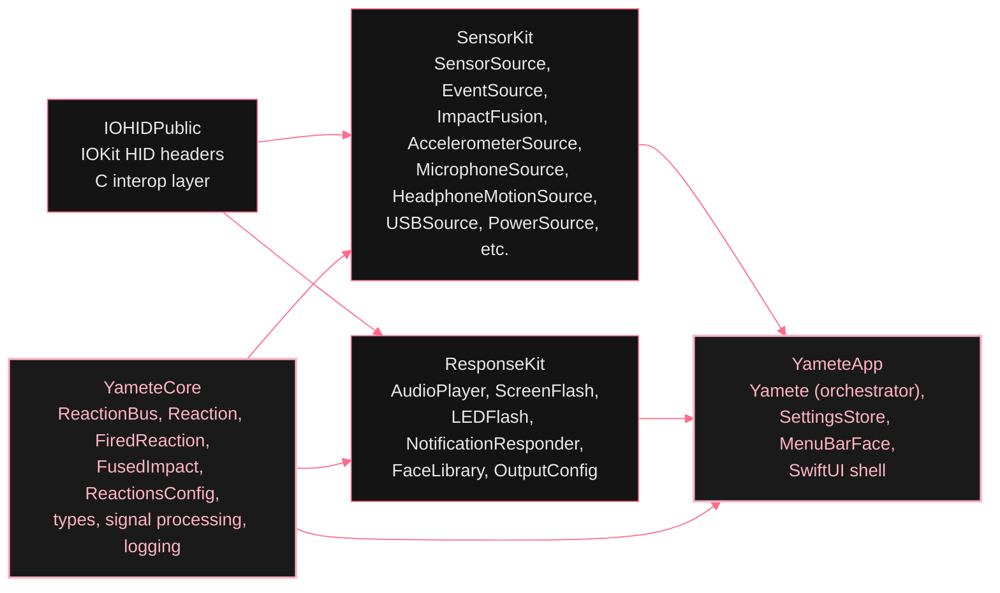

# Architecture

*Yamete is more engineered than a joke app deserves. The whole point of the project is to demonstrate how I build code and design systems, so the documentation walks the same path the code does. One concept per page. Each page has a "why this exists" framing, the diagram, and the file-level pointer.*

If you came here to read the joke, the [home page](/) explains the joke. If you came here to read the code, this is your sidebar.

## The pages

- **[Module graph](/architecture/modules)** Four SPM targets. One direction. Why each layer exists and what it refuses to know.
- **[Signal pipeline](/architecture/signal-pipeline)** Sensor or event to output, end to end. The shape of the bus.
- **[Per-sensor detection gates](/architecture/detection-gates)** Six gates between a raw sample and a published reaction. Why each one exists.
- **[Fusion engine](/architecture/fusion)** Consensus across three impact sensors plus a rearm gate that keeps a single tap from firing twice.
- **[Sensitivity gate](/architecture/sensitivity)** User-facing sensitivity becomes an inverted threshold band that decides which impacts even reach the bus.
- **[Bus enricher](/architecture/enricher)** One pre-fan-out pass that resolves the audio clip, picks the face, and stamps `publishedAt`. So every output sees the same reaction.
- **[Response dispatch](/architecture/responses)** Independent subscribers on the bus, each gated by the per-output per-reaction toggle matrix.
- **[Display / audio pairing](/architecture/display-audio-pairing)** How Yamete pairs monitor speakers with their displays via EDID, and the topologies where the pairing falls back to "we don't know."
- **[LED flash detail](/architecture/led-flash)** Caps Lock PWM dithering + a damped spring on the keyboard backlight. The crash-recovery sentinel that puts the brightness back if everything explodes mid-pulse.
- **[Concurrency model](/architecture/concurrency)** Swift 6 strict concurrency. Where each actor lives, what crosses isolation, why the bus is an actor.
- **[Pipeline lifecycle](/architecture/lifecycle)** How the orchestrator brings the bus, sources, and outputs up. How it tears them down without leaking the IOKit handle.
- **[Source map](/architecture/source-map)** Every Swift file in the project, one line each. The cheat sheet.
- **[Testing](/testing)** Every layer of the test pyramid Yamete drives in anger.

## At a glance

