# Concurrency model

*Yamete builds with Swift 6 complete strict concurrency, no `@unchecked Sendable` escape hatches except for the IOKit boundary types that physically cannot be made `Sendable`. The bus is an `actor` so fan-out is serialised. Sources run on their own queues / `AsyncStream` continuations and hop to the bus actor for `publish`. Outputs run on `@MainActor` only when they touch AppKit (screen flash window pool, status item face swap); LED PWM and audio playback do not.*

Three different thread contexts produce sensor data for the impact pipeline. Each sensor implementation serializes its own hardware-callback state with an `OSAllocatedUnfairLock`, then yields to an `AsyncThrowingStream` outside that lock. `ImpactFusion` fans those streams into a private `AsyncStream` via detached tasks, then drains on a MainActor task. Infrastructure event sources use run-loop callbacks or dispatch-main-queue callbacks and also publish asynchronously to the bus. The bus is an actor; subscribers iterate their `AsyncStream<FiredReaction>` on MainActor tasks.

        
          Thread and actor boundaries

```mermaid
%%{init: {
  "theme": "base",
  "themeVariables": {
    "primaryColor": "#141414",
    "primaryTextColor": "#e8e8e8",
    "primaryBorderColor": "#ff6b8a",
    "lineColor": "#ff6b8a",
    "secondaryColor": "#141414",
    "tertiaryColor": "#0a0a0a",
    "edgeLabelBackground": "#0a0a0a",
    "clusterBkg": "#1a1a1a",
    "clusterBorder": "#ff6b8a",
    "titleColor": "#ffb3c4",
    "nodeTextColor": "#e8e8e8",
    "fontFamily": "SF Mono, ui-monospace, Menlo, monospace"
  }
}}%%
flowchart LR
  subgraph THREADS["OFF-MAIN THREADS  (impact sensors)"]
    T1["HID run-loop thread
IOHIDManager callbacks
AccelerometerSource"]:::thread
    T2["audio I/O thread
AVAudioEngine tap
MicrophoneSource"]:::thread
    T3["OperationQueue
CoreMotion updates
HeadphoneMotionSource"]:::thread
  end

  subgraph LOCKS["OSAllocatedUnfairLock per sensor"]
    L1["serialize: running flag
continuation ref
detector state"]:::lock
  end

  subgraph BRIDGE["AsyncThrowingStream bridge"]
    B1["continuation.yield()
called OUTSIDE lock
(avoids recursive os_unfair_lock)"]:::bridge
  end

  subgraph FUSION["ImpactFusion  (MainActor)"]
    TG["detached tasks
fan-in AsyncStream
one per SensorSource"]:::swift
    FT["fusion task: @MainActor
ingest, gate, sensitivityGate
→ bus.publish(.impact)"]:::main
  end

  subgraph EVT["Event sources  (DispatchQueue.main / CFRunLoop)"]
    ES["USBSource / PowerSource / ...
publish direct to bus
via Task { await bus.publish(...) }"]:::thread
  end

  subgraph BUS_ACTOR["ReactionBus  (actor)"]
    ENR["enricher async closure
audio selection + face indices
→ FiredReaction"]:::main
    FAN["fan-out: subscribers.values
continuation.yield(fired)"]:::main
  end

  subgraph OUTPUTS["Output consumers  (MainActor tasks)"]
    R1["AudioPlayer.consume()
ScreenFlash.consume()
LEDFlash.consume()
NotificationResponder.consume()"]:::mainactor
    MBF["MenuBarFace.consume()"]:::mainactor
  end

  T1 --> L1
  T2 --> L1
  T3 --> L1
  L1 --> B1
  B1 --> TG
  TG --> FT
  FT --> BUS_ACTOR
  ES --> BUS_ACTOR
  ENR --> FAN
  BUS_ACTOR --> OUTPUTS

  classDef thread fill:#1a0a14,stroke:#ff6b8a,color:#e8e8e8
  classDef lock fill:#1a1500,stroke:#fbbf24,color:#e8e8e8
  classDef bridge fill:#0f1520,stroke:#60a5fa,color:#e8e8e8
  classDef swift fill:#0a1a15,stroke:#34d399,color:#e8e8e8
  classDef main fill:#1a1520,stroke:#c084fc,color:#e8e8e8,stroke-width:2px
  classDef mainactor fill:#1a0a14,stroke:#ff6b8a,color:#ffb3c4,stroke-width:2px
```
          

        

        
A subtle constraint: `continuation.finish()` and `continuation.yield()` must be called *outside* each sensor's `OSAllocatedUnfairLock`. `AsyncThrowingStream._Storage` acquires its own `os_unfair_lock` inside those methods, and `os_unfair_lock` is non-reentrant — calling yield or finish while already holding an unfair lock abort-traps (cause 89859). Each sensor captures the continuation reference as the critical section's return value, releases the lock, then calls the stream method outside the lock.
