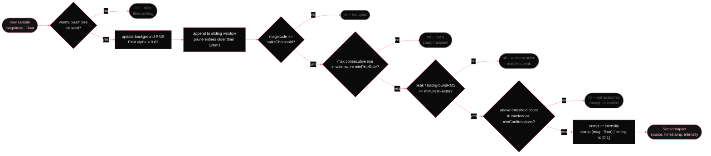

# Per-sensor detection gates

*Every continuous sensor runs the same six-gate pipeline (`ImpactDetector`): warmup, spike threshold, rise rate, crest factor, confirmation count, intensity remap. Each gate kills a specific class of false positive that the gate before it cannot. Walking the gates in order is walking the design conversation about what counts as an impact.*

Every impact sensor runs an `ImpactDetector` independently. Each sample passes through six gates in order. All six must pass to produce an intensity value. Any gate failure returns nil for that sample. no event emitted, no noise downstream.

        
          ImpactDetector.process() -- per-sample gate chain
          

        

        
The combination of these gates is what makes Yamete usable at a desk. Typing produces magnitude but no sharp rise. Footsteps produce a rise but the crest factor is too low (ambient RMS is already elevated). A real smack produces all six: a clean spike, a fast transient, a high crest, and multiple samples above threshold in the window.

        
| Gate | What it rejects | Accel default | Mic default | Headphone default |
|---|---|---|---|---|
| warmupSamples | Filter transients on startup (IIR settling) | 50 samples | 50 samples | 50 samples |
| spikeThreshold | Ambient vibration, background noise | 0.020 g | 0.020 PCM | 0.10 g |
| minRiseRate | Slow drifts, HVAC, sustained rumble | 0.010 | 0.010 | 0.05 |
| minCrestFactor | Noisy rooms, street noise (peak/RMS too low) | 1.5 | 1.5 | 1.5 |
| minConfirmations | One-sample spikes, electrical interference | 3 samples | 2 samples | 2 samples |
| intensity mapping | (output stage) maps passing magnitude to 0-1 | 0.002-0.060 g | 0.005-0.300 | 0.05-2.0 g |
