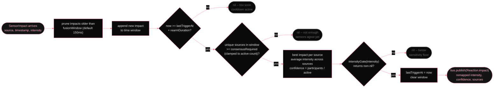

# Fusion engine

*`ImpactFusion` runs a fan-in `TaskGroup` across every active impact sensor, holds a sliding window for consensus, applies sensitivity remapping, and then publishes one `Reaction.impact`. The rearm gate is the difference between an app that yells once when you smack it and an app that yells four times because four sensors agreed.*

Individual sensor impacts feed into `ImpactFusion`, which enforces two additional constraints before publishing a `Reaction.impact` onto the bus: consensus (enough sensors must agree within a time window) and rearm (minimum gap between consecutive responses). Before publishing, the sensitivity gate — an `intensityGate` closure set by the orchestrator — maps raw fused intensity through the user's sensitivity band and drops impacts that fall below the floor.

        
          ImpactFusion.ingest() -- one call per SensorImpact
          

        

        
The default `consensusRequired = 1` means any single sensor can trigger a response. Set it to 2 and both the accelerometer and microphone have to agree within 150 ms before anything fires — eliminates most false positives at the cost of some missed detections on very clean impacts. The engine clamps `consensusRequired` to the active source count at runtime, so "require 2" against a single connected sensor still emits.

        
| Parameter | Default | Effect |
|---|---|---|
| fusionWindow | 150 ms | Time window within which multiple sensors must all fire to count as consensus |
| consensusRequired | 1 | Minimum distinct sensor sources in window before firing (clamped to active count) |
| rearmDuration | user debounce | Minimum gap between consecutive fused impacts; set from SettingsStore.debounce |
