# Pipeline lifecycle

*`Yamete` is the orchestrator. On start it instantiates the bus, registers every active source, registers every output as a subscriber, and observes settings changes to enable/disable sources at runtime. On stop it stops sources first, drains the bus, and tears down outputs last. The `AppleSPUDevice` broker's three-phase teardown (last-subscriber-releases-the-handle) is the hardest invariant in this graph; everything else is plumbing.*

`Yamete` manages the pipeline with `bootstrap()` / `shutdown()` entry points. At bootstrap, outputs subscribe to the bus and the settings observation loop starts. On settings changes, `rebuildPipeline()` restarts the impact sensor pipeline and reconciles the enabled event source set. Outputs do not restart on settings changes — they read a live config snapshot on every reaction via `OutputConfigProvider`.

        
          Yamete pipeline lifecycle

```mermaid
%%{init: {
  "theme": "base",
  "themeVariables": {
    "primaryColor": "#141414",
    "primaryTextColor": "#e8e8e8",
    "primaryBorderColor": "#ff6b8a",
    "lineColor": "#ff6b8a",
    "secondaryColor": "#141414",
    "tertiaryColor": "#0a0a0a",
    "edgeLabelBackground": "#0a0a0a",
    "clusterBkg": "#1a1a1a",
    "clusterBorder": "#ff6b8a",
    "titleColor": "#ffb3c4",
    "nodeTextColor": "#e8e8e8",
    "fontFamily": "SF Mono, ui-monospace, Menlo, monospace"
  }
}}%%
stateDiagram-v2
  [*] --> Initialised : Yamete.init()

  Initialised --> Running : bootstrap()\n— register bus enricher\n— start output consumers\n— rebuildPipeline()\n— start settings observation

  Running --> Running : settings changed\n→ rebuildPipeline()\n (sensor pipeline restarts;\n event sources reconciled;\n outputs read live config)

  Running --> Stopped : shutdown()\n— cancel output tasks\n— cancel settings task\n— fusion.stop()\n— bus.close()\n— ledFlash.resetHardware()

  Stopped --> [*] : app quit
```
          

        

        
The sensor pipeline (ImpactFusion) only runs when at least one output is enabled AND at least one sensor source is enabled. If the user disables all outputs, fusion stops entirely and no HID/mic/CoreMotion resources are held.
