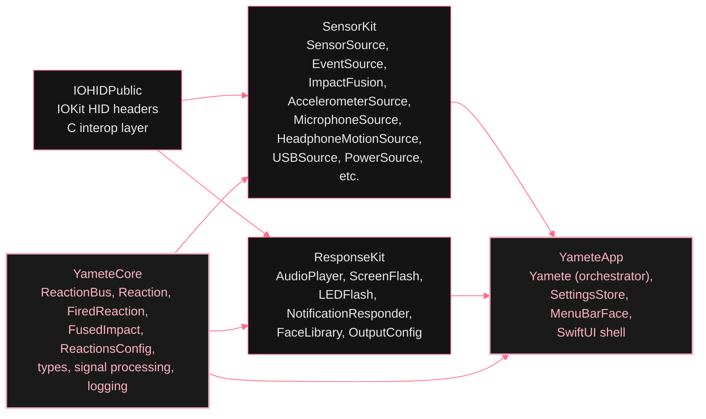

# Module graph

*The dependency graph is a contract about what each layer is allowed to know. `IOHIDPublic` is a header-only bridging shim and knows nothing about Yamete. `YameteCore` knows nothing about sensors or outputs; it only knows what a `Reaction` is. `SensorKit` and `ResponseKit` both depend on `YameteCore` but never on each other; sources publish `Reaction`s, outputs subscribe to `Reaction`s, and the bus is the only handshake between them. `YameteApp` wires everyone together.*

The codebase is split into four Swift Package Manager targets with a strictly unidirectional dependency graph. `YameteApp` sees everything. `IOHIDPublic` sees nothing.

        
          SPM dependency graph
          

        

        
- `IOHIDPublic` -- C header shim exposing private IOKit HID types Apple does not publish. Read-only; never changes.

          - `YameteCore` -- shared types, the reaction bus, signal processing, and logging. No sensor knowledge, no UI. Imported by everything.

          - `SensorKit` -- the entire sensor abstraction: impact sensors (accelerometer, microphone, AirPods motion), infrastructure event sources (USB, power, Bluetooth, audio peripherals, Thunderbolt, display hotplug, sleep/wake), ImpactFusion engine, and ImpactDetector per-sensor gate chain.

          - `ResponseKit` -- audio playback, screen overlay, LED flash, notification dispatch, face image cache. Knows about reactions and intensity; knows nothing about where they came from.

          - `YameteApp` -- the orchestrator. Owns the bus, wires sources and outputs, manages lifecycle. Also the SwiftUI menu bar shell.
