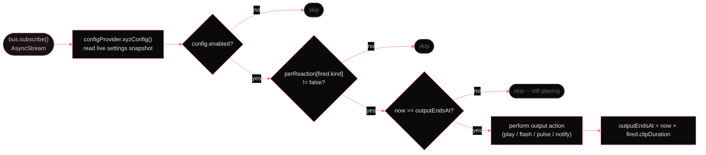

# Response dispatch

*Outputs subscribe to the bus independently. Each output is a `ReactiveOutput` that pattern-matches `ReactionKind` and consults its row of the per-output toggle matrix before firing. A reaction with LED + sound enabled and flash off produces a pulse and a clip and nothing on screen. The matrix is a hard gate, not a hint.*

Each output independently subscribes to the bus via `bus.subscribe()`, which returns a fresh `AsyncStream<FiredReaction>`. The consumer loop reads a live config snapshot on every reaction and gates by: the output's master enable, the per-output per-reaction toggle matrix, and an internal playback-ends-at guard that prevents overlapping responses.

        
          Output consumer loop (same structure for all four outputs)
          

        

        
| Output | Config type | Action | Notes |
|---|---|---|---|
| AudioPlayer | AudioOutputConfig | Plays the pre-selected fired.soundURL on each enabled Core Audio device. Volume = volumeMin + intensity * range. | For non-impact reactions, soundURL is nil. audio skips. |
| ScreenFlash | FlashOutputConfig | Renders a borderless NSWindow overlay per enabled screen: radial gradient + face image. Fade-in / hold / fade-out envelope, timing scaled to intensity. | Window pool reused across reactions. Face pulled from fired.faceIndices. |
| LEDFlash | LEDOutputConfig | PWM-dithers the Caps Lock LED via IOKit HID at 60 Hz. Optionally animates keyboard backlight via KeyboardBrightnessClient (CoreBrightness private framework) with a spring oscillation envelope. Restores both to pre-pulse state on completion. | Crash-recovery sentinel file written before first pulse; deleted on clean restore. |
| NotificationResponder | NotificationOutputConfig | Posts a UNMutableNotificationContent with a tier-matched phrase from a 40-locale string table. Auto-dismisses after dismissAfter. | Locale: user override or system fallback. |

        
`MenuBarFace` also subscribes to the bus independently. It only reacts to `.impact` reactions, swaps the `NSStatusItem` icon to the face at `fired.faceIndices[0]` for `max(0.5, debounce)` seconds, then restores the template icon. It is not an output in the sense of the four above. it has no config provider and no toggle matrix.
