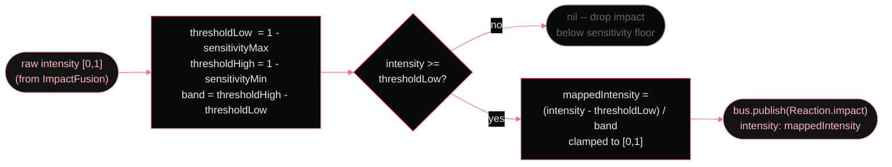

# Sensitivity gate

*`FusedImpact.applySensitivity` maps the raw 0-1 intensity through the user's sensitivity range. Sensitivity is *inverted* against threshold: high sensitivity means low threshold, more reactivity. Below the band, the impact is rejected silently. Above it, intensity is remapped onto a clean 0-1 scale that the rest of the system uses as the audio/face/flash intensity.*

After fusion but before publishing to the bus, intensity passes through one more mapping. The user's sensitivity sliders define a window over the [0,1] intensity range. The gate rejects impacts below the lower edge and linearly rescales survivors to fill [0,1]. This is implemented as an `intensityGate` closure on `ImpactFusion`, set by `Yamete` during init. Infrastructure event sources bypass this gate entirely — they carry synthesized intensities from `ReactionsConfig.eventIntensity`.

        
          Sensitivity window mapping (FusedImpact.applySensitivity)
          

