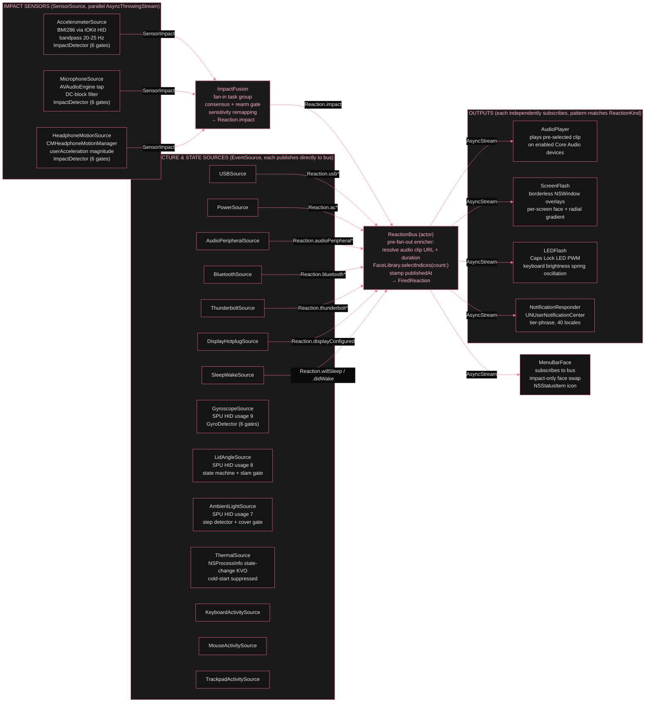

# Signal pipeline

*Two emission patterns feed one bus. Continuous-stream sources (accelerometer, microphone, gyroscope, ambient light) run their own detection pipeline over a high-frequency sample stream and emit one `Reaction` when the pipeline crosses threshold. Discrete state-transition sources (USB, power, audio, Bluetooth, Thunderbolt, display, sleep/wake, lid angle, thermal) observe an OS notification or KVO surface and emit one `Reaction` per user-meaningful state change. Same bus, same envelope, same fan-out.*

Two categories of source publish onto the `ReactionBus`. Impact sources run three parallel sensor streams through `ImpactFusion`, which applies consensus and rearm gating before publishing `Reaction.impact`. Infrastructure event sources (USB, power, Bluetooth, etc.) publish discrete `Reaction` cases directly. The bus runs a pre-fan-out enricher that resolves audio clip URL, clip duration, and face indices exactly once per reaction. Four independent outputs each subscribe to the bus via `bus.subscribe()`, receiving an `AsyncStream<FiredReaction>`, and pattern-match the reaction kinds their per-output toggle matrix enables.

        
          End-to-end signal flow
          

        

        
The bus enricher runs once per reaction before fan-out. All subscribers receive a `FiredReaction` with identical, pre-resolved values: the same `soundURL`, the same `clipDuration`, the same `faceIndices` array, and the same `publishedAt` timestamp. No output re-selects a clip or picks a face. they just consume what the enricher resolved.
